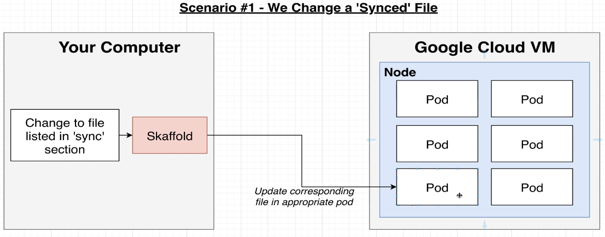
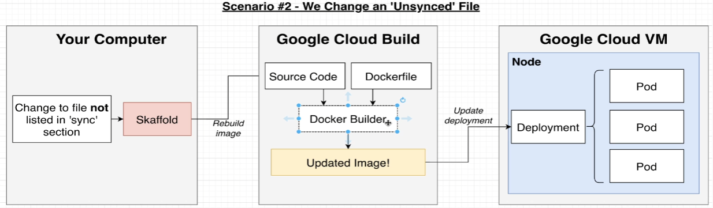
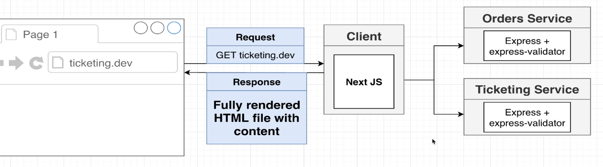
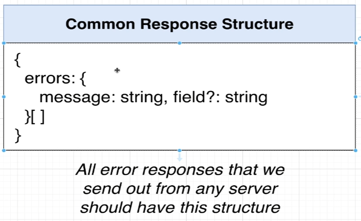

# ticketing-app
Ticketing app where users can list &amp; purchase tickets for events.

# Features
- Users can signup/sign in to their GitTix account
- Users can list a ticket for an event (concert, sports) for sale
- Other users can purchase this ticket
- Any user can list tickets for sale and purchase tickets
- When a user attempts to purchase a ticket, the ticket is 'locked' for 15 minutes. The user has 15 minutes to enter their payment info.
- While locked, no other user cna purchased the ticket. After 15 minutes, the ticket should unlock.
- Ticket prices can be edited if they are not locked.

# Quickstart
## local development
### Prerequisites:
- Docker desktop, ensure you have k8s enabled.
- Update your local `c:\Windows\System32\Drivers\etc\hosts` file and append `127.0.0.1 ticketing.dev` to the file.
- Install nginx loadbalancer/router on your cluster follow the installation steps at [kubernetes.github.io/ingress-nginx](kubernetes.github.io/ingress-nginx)
### Start the app locally:
1. From the project root, run `skaffold dev`. All services will be created on your local docker destop k8s cluster.
2. Open chrome, navigate to `http://ticketing.dev`
3. You will see a browser warning, this is because the nginx server uses a self signed cert and has other prod default configs that makes chrome not trust it. Simply type `thisisunsafe` to make it go away (there's no dialog or anything, just start typing it).
### Hot module reloading
In development, Skaffold will watch all the different services and deploy changes to the cluster as specified in `skaffold.yaml`
There are two types of files that could change:
1. Synced: the file is updated directly on the pod

2. Unsynced: all files are pushed and the image is rebuilt. The k8s deployment is then updated with the new image

## Remote development
Remote development/configuration on GCP/AWS/Azure intentionally foregone due to costs.

# Docs
## System overview
The app is a nextjs client (SSR), which reaches out to various backend microservices.
SSR was chosen for SEO & page load speed.

## Service overview

- [Auth](auth/README.md): everything related to user signup/signin/signout
- `Tickets`: ticket creation/editing. Knows whether a ticket can be updated
- `Orders`: Order creation/editing
- `Expiration`: Watches for orders to be created, cancels them after 15 min
- `Payments`: Handles credit card payments. Cancels orders if payments fails, completes if payments succeed
## DB Schema

## Error response structure

