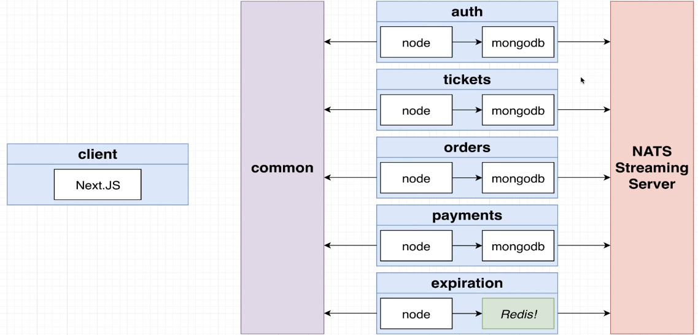
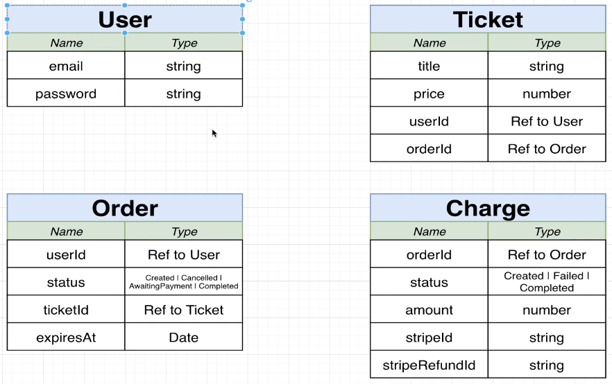

# ticketing-app
Ticketing app where users can list &amp; purchase tickets for events.

# Features
- Users can signup/sign in to their GitTix account
- Users can list a ticket for an event (concert, sports) for sale
- Other users can purchase this ticket
- Any user can list tickets for sale and purchase tickets
- When a user attempts to purchase a ticket, the ticket is 'locked' for 15 minutes. The user has 15 minutes to enter their payment info.
- While locked, no other user cna purchased the ticket. After 15 minutes, the ticket should unlock.
- Ticket prices can be edited if they are not locked.

# Docs
### System overview

- [Auth](auth/README): everything related to user signup/signin/signout
- `Tickets`: ticket creation/editing. Knows whether a ticket can be updated
- `Orders`: Order creation/editing
- `Expiration`: Watches for orders to be created, cancels them after 15 min
- `Payments`: Handles credit card payments. Cancels orders if payments fails, completes if payments succeed
### DB Schema
