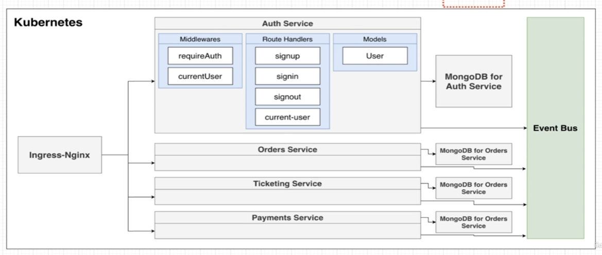
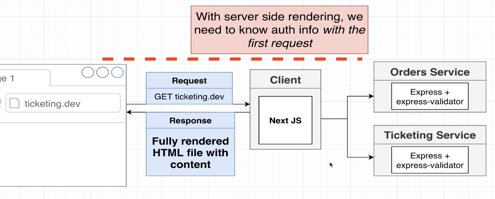
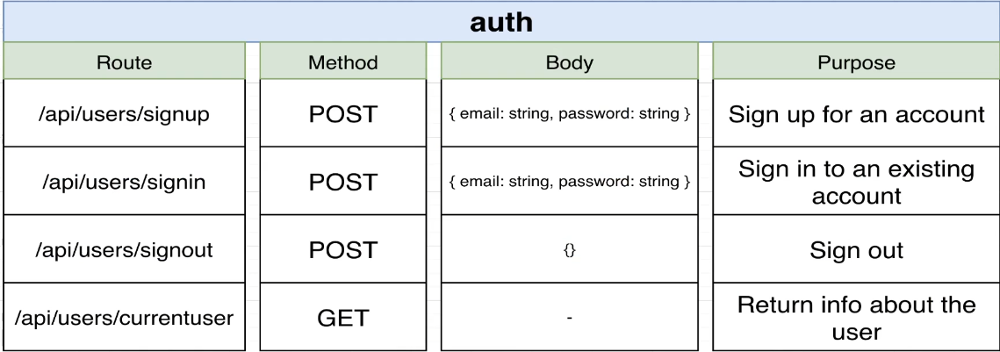
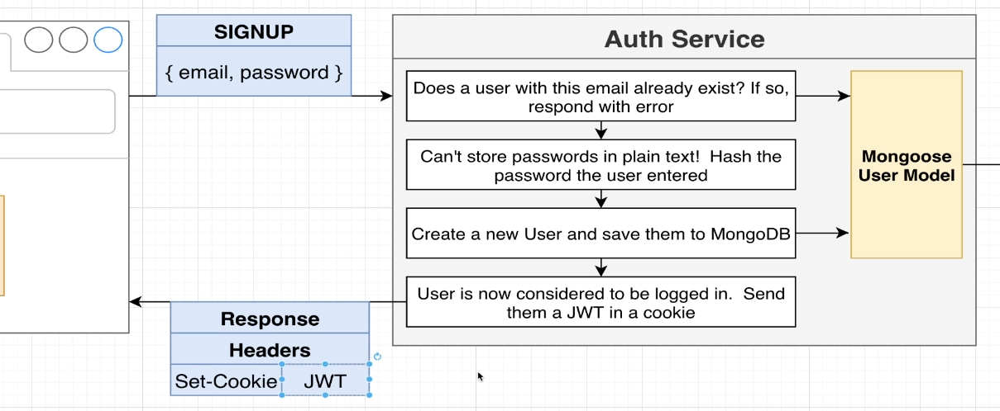
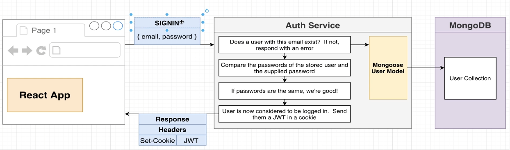

# system diagram

# on auth with SSR

Since our client is a SSR app (nextjs), we need auth info on the very first page load before any js is loaded.
To achieve this, we'll store the JWT in a cookie.  

# api spec

# signup flow

When running in https protocol, a httpOnly cookie will be sent back to the browser with the users JWT inside.
The JWT is base64 encoded.

# signin flow

